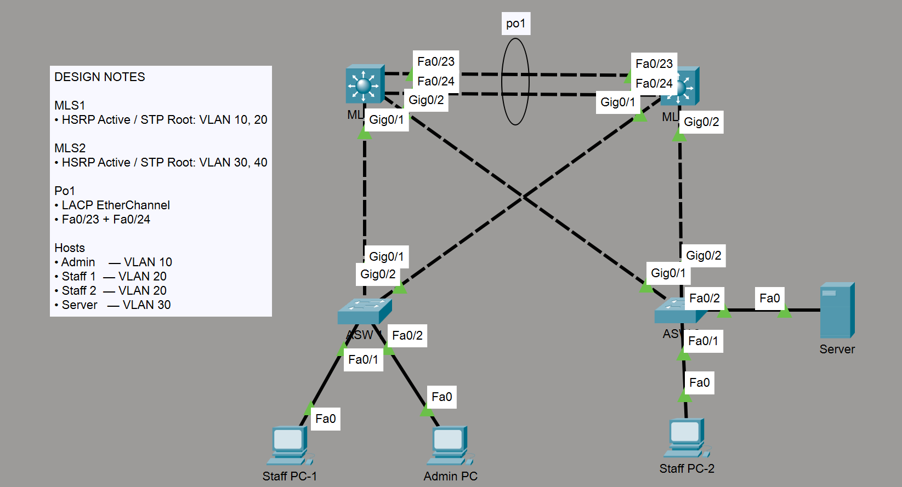

# Layer 2/3 Network High Availability Lab

## Overview

A failed switch or network link can disconnect users from the services they need. I built a network in Cisco Packet Tracer with redundant connections and gateways, then tested how it responded to six failure scenarios.

**Result:** connectivity remained available or recovered across the tested scenarios. One key finding: traffic could take another path while the same gateway remained active.

This project follows a full validation workflow: design the network, configure it, verify the baseline, introduce failures, diagnose the behavior, restore service, and document the results.

## Topology

Two distribution switches connect to two access switches, serving admin, staff, and server endpoints. Each access switch connects to both distribution switches. The diagram shows physical connections, not per-VLAN forwarding state.

## What This Project Demonstrates

| Core technology / skill | Purpose |
| --- | --- |
| HSRP | Provides a backup default gateway |
| Rapid-PVST+ | Manages loop-free forwarding and alternate Layer 2 paths |
| Redundant uplinks | Provide another connection when an access uplink fails |
| Inter-VLAN routing | Connects separate VLANs through switch virtual interfaces (SVIs) |
| Failure testing and recovery | Checks connectivity and protocol behavior during faults and restoration |

LACP EtherChannel supports the design as an additional connection between the distribution switches.

## Compact Design Summary

| Area | Design |
| --- | --- |
| Platform | Packet Tracer; two Cisco 3560 distribution and two Cisco 2960 access switches |
| Segmentation | VLAN 10 Admin, 20 Staff, 30 Server, 40 Management; native VLAN 999 |
| Preferred gateway / STP root | MLS1 for VLANs 10/20; MLS2 for VLANs 30/40 |
| Inter-distribution link | Po1: two FastEthernet members using LACP |

## Testing Summary

| Completed failure scenario | Main observation |
| --- | --- |
| Single Po1 member failure | Bundle stayed operational through the remaining member. |
| Complete Po1 failure | Alternate paths remained; gateway failover was not necessarily triggered. |
| Single access-uplink failure | STP redirected traffic; MLS1 stayed HSRP Active for VLAN 20. |
| Partial MLS1 isolation | Connectivity remained available or recovered as intended. |
| Complete MLS1 failure | HSRP roles changed and STP reconverged for affected VLANs. |
| Complete MLS2 failure | HSRP roles changed and STP reconverged for affected VLANs. |

After restoration, connectivity and the original preferred HSRP/STP roles returned.

## Key Findings

- **A new path does not always mean a new gateway.** Layer 2 redundancy can preserve access to the existing HSRP Active switch.
- **Reachability alone does not explain recovery.** Ping checked connectivity; switch commands checked HSRP/STP state; Simulation Mode showed the traffic path.

## Limitations and Future Improvement

Po1 member redundancy worked, but STP normally preferred lower-cost Gigabit paths through the access layer over the FastEthernet bundle. This is an interface-allocation tradeoff, not an EtherChannel fault. A future version could use switches with enough Gigabit ports for both access uplinks and the inter-distribution bundle.

Results describe Packet Tracer behavior, without measured recovery times or lossless-failover claims.

## Links and Repository Structure

See [Testing and Validation](TESTING-AND-VALIDATION.md) for addressing, interface mappings, protocol settings, test reasoning, commands, and validation boundaries. Device configurations and the lab file are linked below.

<pre>
Redundant-Layer2-Layer3-HA-Lab/
├── <a href="README.md">README.md</a>
├── <a href="TESTING-AND-VALIDATION.md">TESTING-AND-VALIDATION.md</a>
├── <a href="packet-tracer/">packet-tracer/</a>
│   └── <a href="packet-tracer/Layer 2-3 Network High Availability Lab.pkt">Layer 2-3 Network High Availability Lab.pkt</a>
├── <a href="configs/">configs/</a>
│   ├── <a href="configs/MLS1.txt">MLS1.txt</a>
│   ├── <a href="configs/MLS2.txt">MLS2.txt</a>
│   ├── <a href="configs/ASW1.txt">ASW1.txt</a>
│   └── <a href="configs/ASW2.txt">ASW2.txt</a>
└── <a href="screenshots/">screenshots/</a>
    └── <a href="screenshots/topology.png">topology.png</a>
</pre>
